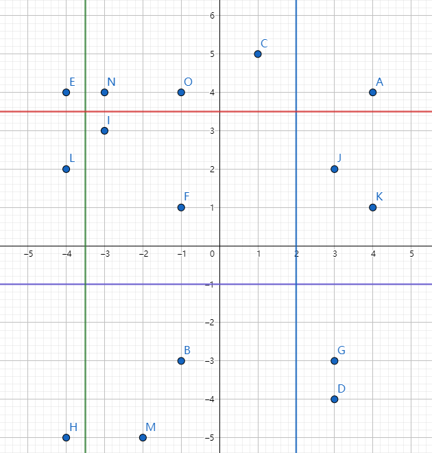

---
tags:
  - Notebooks/OI/OJ/Luogu
title: CF260E-Dividing Kingdom
date: '2020-05-04 19:19:31.726810'
modified: '2020-05-04 19:19:31.726837'

lastmod: 2025-05-29T17:38:45+08:00
---

# CF260E-Dividing Kingdom

## 题目:

### 题目描述:

A country called Flatland is an infinite two-dimensional plane. Flatland has $ n $ cities, each of them is a point on the plane.

Flatland is ruled by king Circle IV. Circle IV has 9 sons. He wants to give each of his sons part of Flatland to rule. For that, he wants to draw four distinct straight lines, such that two of them are parallel to the $ Ox $ axis, and two others are parallel to the $ Oy $ axis. At that, no straight line can go through any city. Thus, Flatland will be divided into 9 parts, and each son will be given exactly one of these parts. Circle IV thought a little, evaluated his sons' obedience and decided that the $ i $ -th son should get the part of Flatland that has exactly $ a_{i} $ cities.

Help Circle find such four straight lines that if we divide Flatland into 9 parts by these lines, the resulting parts can be given to the sons so that son number $ i $ got the part of Flatland which contains $ a_{i} $ cities.

### 输入格式:

The first line contains integer $ n\ (9<=n<=10^{5}) $ — the number of cities in Flatland. Next $ n $ lines each contain two space-separated integers: $ x_{i},y_{i}\ (-10^{9}<=x_{i},y_{i}<=10^{9}) $ — the coordinates of the $ i $ -th city. No two cities are located at the same point. The last line contains nine space-separated integers: .

### 输出格式:

If there is no solution, print a single integer -1.

Otherwise, print in the first line two distinct real space-separated numbers: $ x_{1},x_{2} $ — the abscissas of the straight lines that are parallel to the $ Oy $ axis. And in the second line print two distinct real space-separated numbers: $ y_{1},y_{2} $ — the ordinates of the straight lines, parallel to the $ Ox $ . If there are multiple solutions, print any of them.

When the answer is being checked, a city is considered to lie on a straight line, if the distance between the city and the line doesn't exceed $ 10^{-6} $ . Two straight lines are considered the same if the distance between them doesn't exceed $ 10^{-6} $ .

### 样例:

#### 样例输入 1:

```
9
1 1
1 2
1 3
2 1
2 2
2 3
3 1
3 2
3 3
1 1 1 1 1 1 1 1 1

```

#### 样例输出 1:

```
1.5000000000 2.5000000000
1.5000000000 2.5000000000

```

#### 样例输入 2:

```
15
4 4
-1 -3
1 5
3 -4
-4 4
-1 1
3 -3
-4 -5
-3 3
3 2
4 1
-4 2
-2 -5
-3 4
-1 4
2 1 2 1 2 1 3 2 1

```

#### 样例输出 2:

```
-3.5000000000 2.0000000000
3.5000000000 -1.0000000000

```

#### 样例输入 3:

```
10
-2 10
6 0
-16 -6
-4 13
-4 -2
-17 -10
9 15
18 16
-5 2
10 -5
2 1 1 1 1 1 1 1 1

```

#### 样例输出 3:

```
-1

```

## 思路:

细节还是很多的。

首先不难想到暴力全排列枚举每个块是哪个，然后用数据结构来判定可不可行。

首先你需要先把这些点离散化，然后考虑先横向分，再竖向分。



以第二个样例为例，我们要先确定绿线和蓝线的位置。这个可以通过对 xx 轴记前缀和来得到。

接着确定红线和紫线，就需要建一个主席树来支持二维数点。但是这里要注意，一定要把这 33 列里每个可能的位置都试一遍，这样才能枚举到答案。

## 实现:

```cpp
#include "ybwhead/ios.h"
#define maxn (int)(1e5 + 10)
int x[maxn], y[maxn], n;
int c[50];
struct node
{
    int x, y;
} a[maxn];
int root[maxn];
int cntx, cnty;
int cmp(node a, node b)
{
    return a.x < b.x;
}
int tot;
struct pre
{
    int ls, rs, sum;
} xp[maxn << 5];
void update(int &p, int las, int l, int r, int v)
{
    // cout << l << " " << r << endl;
    // for(int i=1;i<=1e9;i++)
    //     ;
    p = ++tot;
    xp[p] = xp[las];
    ++xp[p].sum;
    if (l == r)
        return;
    int mid = (l + r) >> 1;
    if (v <= mid)
        update(xp[p].ls, xp[las].ls, l, mid, v);
    else
        update(xp[p].rs, xp[las].rs, mid + 1, r, v);
}
int qry(int p, int l, int r, int L, int R)
{
    if ((!p) || L <= l && r <= R)
        return xp[p].sum;
    int mid = (l + r) >> 1, ans = 0;
    if (L <= mid)
        ans += qry(xp[p].ls, l, mid, L, R);
    if (R > mid)
        ans += qry(xp[p].rs, mid + 1, r, L, R);
    return ans;
}
int kth(int p, int las, int l, int r, int k)
{
    if (l == r)
        return l;
    int ans = xp[xp[las].ls].sum - xp[xp[p].ls].sum, mid = (l + r) >> 1;
    if (ans >= k)
        return kth(xp[p].ls, xp[las].ls, l, mid, k);
    else
        return kth(xp[p].rs, xp[las].rs, mid + 1, r, k - ans);
}
int Sum(int l, int r, int L, int R)
{
    return qry(root[r], 1, cnty, L, R) - qry(root[l - 1], 1, cnty, L, R);
}
void solve()
{
    // for (int i = 1; i <= 1e8; i++)
    //     ;
    int l = 1, r = cntx;
    while (l < r)
    {
        int mid = (l + r) >> 1;
        if (xp[root[mid]].sum >= c[3])
        {
            r = mid;
        }
        else
        {
            l = mid + 1;
        }
    }
    if (l == 0 || xp[root[l]].sum != c[3])
        return;
    int p1 = l;
    l = 1, r = cntx;
    while (l < r)
    {
        int mid = (l + r) >> 1;
        if (xp[root[mid]].sum >= c[6])
        {
            r = mid;
        }
        else
        {
            l = mid + 1;
        }
    }
    if (l == 0 || xp[root[l]].sum != c[6])
        return;
    int p2 = l;
    int posx = kth(root[0], root[p1], 1, cnty, c[1]);
    while (Sum(1, p1, 1, posx) != c[1] || Sum(p1 + 1, p2, 1, posx) != c[4] - c[3] || Sum(p2 + 1, cntx, 1, posx) != c[7] - c[6])
    {
        // cout << Sum(p2 + 1, cntx, 1, posx) << " " << p2 << " " << cntx << " " << posx << endl;
        // for (int i = 1; i <= 1e6; i++)
        //     ;
        if (Sum(1, p1, 1, posx) != c[1])
            return;
        ++posx;
    }
    int posxx = kth(root[0], root[p1], 1, cnty, c[2]);
    while (Sum(1, p1, posx + 1, posxx) != c[2] - c[1] || Sum(p1 + 1, p2, posx + 1, posxx) != c[5] - c[4] || Sum(p2 + 1, cntx, posx + 1, posxx) != c[8] - c[7])
    {
        if (Sum(1, p1, posx + 1, posxx) != c[2] - c[1])
            return;
        ++posxx;
    }
    yout << x[p1] + 0.5 << " " << x[p2] + 0.5 << "\n"
         << y[posx] + 0.5 << " " << y[posxx] + 0.5 << endl;

    exit(0);
}
int main()
{
    yin >> n;
    for (int i = 1; i <= n; i++)
    {
        yin >> a[i].x >> a[i].y;
        // yin >> x[i] >> y[i];
        x[i] = a[i].x;
        y[i] = a[i].y;
    }
    for (int i = 1; i <= 9; i++)
        yin >> c[i];
    sort(x + 1, x + n + 1);
    cntx = unique(x + 1, x + n + 1) - (x + 1);

    sort(y + 1, y + n + 1);
    cnty = unique(y + 1, y + n + 1) - (y + 1);
    for (int i = 1; i <= n; i++)
    {
        a[i].x = lower_bound(x + 1, x + cntx + 1, a[i].x) - x;
        a[i].y = lower_bound(y + 1, y + cnty + 1, a[i].y) - y;
    }
    sort(a + 1, a + n + 1, cmp);
    for (int i = 1; i <= n; i++)
    {
        if (a[i].x != a[i - 1].x)
            root[a[i].x] = root[a[i - 1].x];
        // cout << a[i].x << endl;
        update(root[a[i].x], root[a[i].x], 1, cnty, a[i].y);
    }
    sort(c + 1, c + 10);
    do
    {
        for (int i = 1; i <= 9; i++)
            c[i] += c[i - 1];
        solve();
        for (int i = 9; i >= 1; i--)
            c[i] -= c[i - 1];
    } while (next_permutation(c + 1, c + 10));
    puts("-1");
    return 0;
}
```
